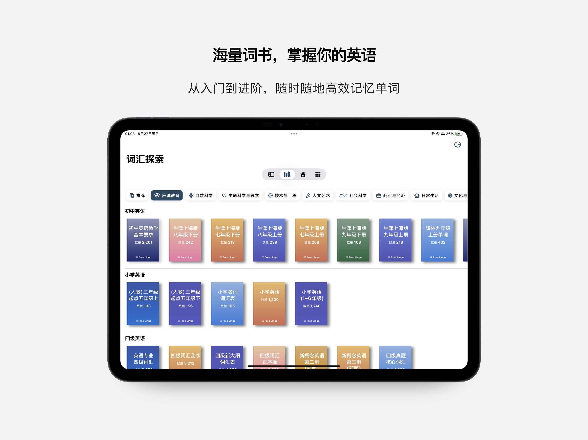

# LaunchFrame Renderer

[简体中文](README.md) | English

LaunchFrame Renderer is a zero-dependency HTML tool for creating App Store promotional screenshots. It combines a set of iOS screenshots, portrait iPhone device frames, and editable marketing copy into previewable and exportable `1320 × 2868` artwork. Each input screenshot becomes a separate poster.



## Features

- Import or append up to 10 iOS screenshots in PNG, JPEG, or WebP format
- Edit the headline, supporting copy, and screenshot fit mode independently for each poster
- Reorder or remove screenshots from the poster sequence
- Share one device frame and layout configuration across the entire poster set
- Choose from 15 portrait frames for iPhone 17, iPhone 17 Pro, iPhone 17 Pro Max, and iPhone Air
- Adjust the device width and vertical position
- Export the current poster as a local `1320 × 2868` PNG
- Export every poster in sequence as separate PNG files
- Use a render-only mode with Playwright, Puppeteer, or other browser automation tools
- Run without frameworks, build tools, npm packages, or third-party JavaScript libraries

Batch export deliberately reuses the same PNG export path as single-poster export. It downloads individual PNG files and does not create a ZIP archive or require a ZIP library.

## App Store Screenshot Sizes

LaunchFrame Renderer exports a `1320 × 2868` portrait canvas, which is one of Apple's accepted screenshot sizes for 6.9-inch iPhone displays.

`1242 × 2688` is also a valid portrait size, but it belongs to the 6.5-inch display category and is not the only accepted iPhone screenshot size.

See Apple's current [screenshot specifications](https://developer.apple.com/help/app-store-connect/reference/app-information/screenshot-specifications/) before submitting assets to App Store Connect.

## Quick Start

From the project directory, start a local static server:

```bash
python3 -m http.server 4173
```

Then open:

```text
http://localhost:4173/
```

The editor initially displays `assets/sample-screenshot.png`.

After capturing screenshots from Xcode or Simulator, select one or more local images to replace the sample. You can append more screenshots later, up to a total of 10.

Click a thumbnail to edit that poster. The headline, supporting copy, and screenshot fit mode are stored independently for each poster. The selected device frame, device width, and vertical position are shared by the entire set.

Use **Export Current PNG** to download the selected poster, or **Export All** to trigger one PNG download for each poster in the current order. Batch export does not create a ZIP file.

The browser may ask you to allow multiple downloads the first time you use **Export All**. If only some files are downloaded, allow multiple downloads for the local site and try again.

## Render-only Mode

Open the renderer with the `render=1` query parameter to hide the editor and display only the poster:

```text
http://localhost:4173/?render=1
```

The render-only view supports the following query parameters:

| Parameter | Description | Example |
| --- | --- | --- |
| `title` | Headline; line breaks are supported | `title=Learn%20faster` |
| `subtitle` | Supporting copy; line breaks are supported | `subtitle=One%20lesson%20at%20a%20time` |
| `frame` | Device frame ID | `frame=iphone-17-black` |
| `screenshot` | URL of an accessible screenshot | `screenshot=./screens/home.png` |
| `fit` | Screenshot fit mode: `cover` or `contain` | `fit=cover` |
| `deviceWidth` | Device width on the poster canvas | `deviceWidth=930` |
| `deviceTop` | Distance from the top of the canvas to the device | `deviceTop=730` |

A cross-origin `screenshot` URL must return CORS response headers that allow the renderer's origin to read the image. Same-origin images and local images selected through the editor are unaffected.

Example:

```text
http://localhost:4173/?render=1&frame=iphone-17-pro-max-deep-blue&deviceTop=730
```

Capture the page with a `1320 × 2868` browser viewport to obtain the complete poster canvas. Simulator screenshot paths and localized copy can be injected through the query parameters for automated rendering.

## Project Structure

```text
.
├── index.html
├── styles.css
├── app.js
├── README.md
├── README_EN.md
├── THIRD_PARTY_ASSETS.md
├── LICENSE
├── assets/
│   ├── frames/
│   └── sample-screenshot.png
└── docs/
    └── preview.jpg
```

## Roadmap

- Automated simulator launch, navigation, and screenshot capture
- Localized copy configuration and batch rendering
- Additional App Store Connect size presets

## Assets and Trademarks

The MIT License covers only the original code and documentation in this repository. Third-party device artwork, trademarks, product designs, the sample screenshot, and the preview image are not included under the MIT License.

Before using or redistributing files under `assets/frames`, `assets/sample-screenshot.png`, or `docs/preview.jpg`, read [THIRD_PARTY_ASSETS.md](THIRD_PARTY_ASSETS.md) and confirm that your intended use complies with the relevant rights holders' terms.

This project is not affiliated with or endorsed by Apple Inc. Apple, iPhone, and App Store are trademarks of Apple Inc.

## License

Original code and documentation are available under the [MIT License](LICENSE).
