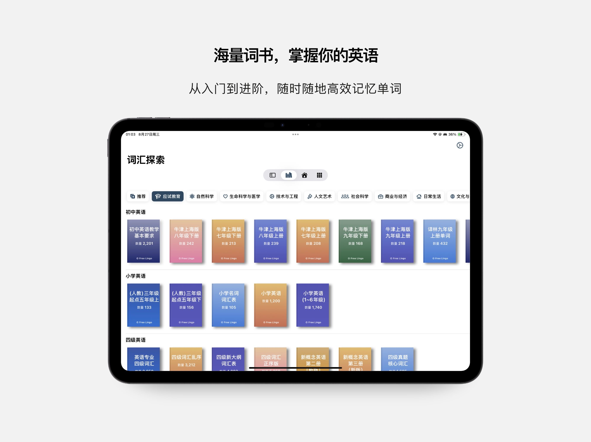

# LaunchFrame Renderer

[简体中文](README.md) | English

LaunchFrame Renderer is a zero-dependency HTML tool for creating App Store promotional screenshots. It combines app screenshots, Apple device frames, and editable marketing copy into previewable and exportable iPhone or iPad artwork. Each primary screenshot becomes a separate poster; iPhone screenshots referenced by iPad cross-device layouts remain companion-only assets.



## Features

- Import or append up to 10 iPhone or iPad screenshots in PNG, JPEG, or WebP format
- Edit the headline, supporting copy, and screenshot fit mode independently for each poster
- Reorder or remove screenshots from the poster sequence
- Choose one of nine iPhone layouts per poster: Classic Hero, Editorial Shift, Focus Lens, Duo Flow, Duo Compare, Depth Stack, Arc Fan, Step Cascade, or Card Gallery
- Choose one of twelve iPad layouts per poster: eight iPad-only compositions plus Ecosystem Hero, Capture to Canvas, Continuity Stack, and Companion Mode
- Keep portrait iPhone companion screenshots in a dedicated iPad-side asset pool that never enters the poster order or exports independently
- Share one primary frame and one of four curated themes—Porcelain, Midnight, Aurora, or Electric—across each product set; iPad cross-device layouts also share one companion iPhone frame
- Automatically fill up to three screenshot slots from the poster order, with stable manual overrides
- Drag screenshots directly between multi-screen frames to swap them, or drop a local image into a target frame
- Safely tune scale, vertical offset, spread, and tilt; mirror supported iPad compositions; and add optional one-line step annotations
- Choose from 15 portrait frames for iPhone 17, iPhone 17 Pro, iPhone 17 Pro Max, and iPhone Air
- Choose from four landscape Space Black or Silver frames for the 11-inch and 13-inch iPad Pro (M5)
- Start the iPad editor with a bundled `2360 × 1640` sample screenshot and the 13-inch Silver frame
- Automatically match the closest 11-inch or 13-inch iPad frame from the first imported screenshot's aspect ratio
- Adjust the device width and vertical position
- Export an iPhone `1320 × 2868` or iPad `2732 × 2048` PNG
- Export every poster in sequence as separate PNG files
- Use a render-only mode with Playwright, Puppeteer, or other browser automation tools
- Run without frameworks, build tools, npm packages, or third-party JavaScript libraries

Batch export deliberately reuses the same PNG export path as single-poster export. It downloads individual PNG files and does not create a ZIP archive or require a ZIP library.

## App Store Screenshot Sizes

The iPhone renderer exports a `1320 × 2868` portrait canvas, which is one of Apple's accepted screenshot sizes for 6.9-inch iPhone displays.

`1242 × 2688` is also a valid portrait size, but it belongs to the 6.5-inch display category and is not the only accepted iPhone screenshot size.

The iPad renderer exports a `2732 × 2048` landscape canvas, which is an accepted screenshot size for 13-inch iPad displays.

See Apple's current [screenshot specifications](https://developer.apple.com/help/app-store-connect/reference/app-information/screenshot-specifications/) before submitting assets to App Store Connect.

## Quick Start

From the project directory, start a local static server:

```bash
python3 -m http.server 4173
```

Then open the renderer you need:

```text
iPhone: http://localhost:4173/
iPad:   http://localhost:4173/ipad.html
```

The iPhone editor initially displays `assets/sample-screenshot.png`. The iPad editor initially displays `assets/sample-ipad-screenshot.png` in the 13-inch Silver frame. Both entries are ready to preview and export immediately.

After capturing screenshots from Xcode or Simulator, select one or more local images to replace the corresponding sample. You can append more screenshots later, up to a total of 10.

Click a thumbnail to edit that poster. The headline, supporting copy, screenshot fit mode, and layout are stored independently for each poster. The primary frame, optional companion frame, and theme are each shared by the entire product set.

For two- and three-screen layouts, secondary slots automatically use the next unique screenshots in sequence and wrap when necessary. You can override slots manually; the override remains stable after reordering and falls back automatically if the referenced screenshot is deleted. You can also drag one preview image onto another to swap them, or drop a local image into a target frame; the local image is added to the screenshot set and assigned to that slot immediately. Export is disabled when a required slot is empty, an image cannot be read, copy enters the device safe area, or a step label overflows.

The iPad editor groups four additional layouts under **Cross-device collaboration**. They keep the current iPad poster as the primary screen and require one portrait iPhone companion screenshot. Companion assets can be imported, selected, fitted, and removed independently; stable asset IDs preserve page-level assignments, and a deleted reference falls back to the next available asset. The default companion frame is iPhone Air in Cloud White. Use these layouts only for real implemented behavior—do not imply sync, continuity, or live collaboration unless the app actually provides it.

The Classic layout retains the existing device-width and vertical-position controls. New layouts expose bounded scale, vertical offset, spread, and tilt controls. iPhone Focus Lens and iPad Detail Callout also expose horizontal and vertical focus controls, and supported iPad layouts can be mirrored. Newly imported screenshots still start with Classic; the renderer never assigns a new layout automatically.

The iPad editor defaults to the 13-inch Silver frame and **Stretch to fit** so the screenshot is neither cropped nor letterboxed. A slight aspect-ratio adjustment may occur when the screenshot and frame do not match exactly; other frames, **Cover**, and **Contain** remain available.

Use **Export Current PNG** to download the selected poster, or **Export All** to trigger one PNG download for each poster in the current order. Batch export does not create a ZIP file.

The browser may ask you to allow multiple downloads the first time you use **Export All**. If only some files are downloaded, allow multiple downloads for the local site and try again.

## Render-only Mode

Open either renderer with the `render=1` query parameter to hide the editor and display only the poster:

```text
iPhone: http://localhost:4173/?render=1
iPad:   http://localhost:4173/ipad.html?render=1
```

The render-only view supports the following query parameters:

| Parameter | Description | Example |
| --- | --- | --- |
| `title` | Headline; line breaks are supported | `title=Learn%20faster` |
| `subtitle` | Supporting copy; line breaks are supported | `subtitle=One%20lesson%20at%20a%20time` |
| `frame` | Device frame ID | `frame=iphone-17-black` |
| `screenshot` | URL of an accessible screenshot | `screenshot=./screens/home.png` |
| `fit` | Screenshot fit mode: `fill`, `cover`, or `contain`; `fill` is iPad-only | `fit=fill` |
| `deviceWidth` | Device width on the poster canvas | `deviceWidth=930` |
| `deviceTop` | Distance from the top of the canvas to the device | `deviceTop=730` |
| `layout` | Layout ID for the current product; omitted or invalid values fall back to `classic` | `layout=duo-flow` |
| `theme` | Theme: `porcelain`, `midnight`, `aurora`, or `electric` | `theme=midnight` |
| `screenshot2` / `screenshot3` | Accessible URLs for secondary layout slots | `screenshot2=./screens/result.png` |
| `fit2` / `fit3` | Fit mode for secondary screenshots; iPad also accepts `fill` | `fit2=contain` |
| `layoutScale` | New-layout scale: iPhone `0.92–1.06`; iPad `0.94–1.05` | `layoutScale=1.02` |
| `layoutY` | New-layout vertical offset: iPhone `-120–120`; iPad `-80–80` | `layoutY=40` |
| `layoutSpread` | Multi-screen spread: iPhone `0.85–1.15`; iPad `0.90–1.10` | `layoutSpread=1.08` |
| `layoutTilt` | Tilt strength in the `0–1` range | `layoutTilt=0.8` |
| `layoutMirror` | Set to `1` to mirror supported iPad compositions | `layoutMirror=1` |
| `annotations` | Set to `1` to show the supported connector, numbers, and labels | `annotations=1` |
| `annotation1`…`annotation3` | Up to three single-line step labels | `annotation1=Choose%20a%20source` |
| `focusX` / `focusY` | Focus Lens or Detail Callout position in the `0.2–0.8` range | `focusX=0.62` |
| `iphoneScreenshot` | Portrait iPhone screenshot URL required by iPad cross-device layouts | `iphoneScreenshot=./screens/phone-home.png` |
| `iphoneFit` | Companion screenshot fit: `cover` or `contain` | `iphoneFit=contain` |
| `iphoneFrame` | Companion frame ID; defaults to `iphone-air-cloud-white` | `iphoneFrame=iphone-air-cloud-white` |

A cross-origin `screenshot`, `screenshot2`, `screenshot3`, or `iphoneScreenshot` URL must return CORS response headers that allow the renderer's origin to read the image. Same-origin images and local images selected through the editor are unaffected. When an iPad `frame` is omitted, the renderer matches one from the screenshot aspect ratio; an explicit `frame` parameter takes priority.

Example:

```text
http://localhost:4173/?render=1&frame=iphone-17-pro-max-deep-blue&deviceTop=730
http://localhost:4173/?render=1&layout=duo-flow&theme=midnight&screenshot=./screens/input.png&screenshot2=./screens/result.png&annotations=1&annotation1=Choose%20a%20source&annotation2=Ready%20to%20learn
http://localhost:4173/ipad.html?render=1&frame=ipad-pro-m5-13-space-black&screenshot=./screens/ipad-home.png
http://localhost:4173/ipad.html?render=1&layout=master-detail&theme=aurora&frame=ipad-pro-m5-13-silver&screenshot=./screens/ipad-home.png&screenshot2=./screens/ipad-list.png&screenshot3=./screens/ipad-detail.png
http://localhost:4173/ipad.html?render=1&layout=capture-to-canvas&theme=midnight&screenshot=./screens/ipad-result.png&iphoneScreenshot=./screens/phone-input.png&annotations=1&annotation1=Deep%20work&annotation2=Quick%20capture
```

iPhone `layout` values are `classic`, `editorial-shift`, `focus-lens`, `duo-flow`, `duo-compare`, `depth-stack`, `arc-fan`, `step-cascade`, and `card-gallery`.

iPad `layout` values are `classic`, `editorial-split`, `panorama-stage`, `detail-callout`, `duo-flow`, `compare-split`, `master-detail`, `window-gallery`, `ecosystem-hero`, `capture-to-canvas`, `continuity-stack`, and `companion-mode`. The final four require `iphoneScreenshot`. IDs that belong to the other product—or are unknown—fall back safely to `classic`. With no new parameters, both products keep using the original Classic rendering path.

Render-only mode exposes `data-render-state="loading"`, `ready`, or `error` on `<body>`. Missing slots, unreadable images, a non-portrait iPhone companion, copy entering the device safe area, and overflowing labels set `error` and provide a reason in `data-render-error`. Browser automation should wait for `ready` instead of silently capturing an invalid poster.

Capture the page with the viewport that matches the selected renderer—`1320 × 2868` for iPhone or `2732 × 2048` for iPad—to obtain the complete poster canvas. Simulator screenshot paths and localized copy can be injected through the query parameters for automated rendering.

## Project Structure

```text
.
├── index.html
├── ipad.html
├── styles.css
├── layouts.js
├── app.js
├── README.md
├── README_EN.md
├── THIRD_PARTY_ASSETS.md
├── LICENSE
├── assets/
│   ├── frames/
│   │   └── iPad Pro (M5)/
│   ├── sample-screenshot.png
│   └── sample-ipad-screenshot.png
├── docs/
│   └── preview.jpg
└── tests/
    └── layouts.test.cjs
```

## Roadmap

- Automated simulator launch, navigation, and screenshot capture
- Localized copy configuration and batch rendering
- Additional App Store Connect size presets

## Assets and Trademarks

The MIT License covers only the original code and documentation in this repository. Third-party device artwork, trademarks, product designs, the sample screenshot, and the preview image are not included under the MIT License.

Before using or redistributing files under `assets/frames`, `assets/sample-screenshot.png`, `assets/sample-ipad-screenshot.png`, or `docs/preview.jpg`, read [THIRD_PARTY_ASSETS.md](THIRD_PARTY_ASSETS.md) and confirm that your intended use complies with the relevant rights holders' terms.

Cross-device layouts render the repository's existing iPad and iPhone frames together without changing their third-party licensing scope. You are also responsible for the rights and accuracy of imported app screens, account data, people, and visible content.

This project is not affiliated with or endorsed by Apple Inc. Apple, iPhone, iPad, and App Store are trademarks of Apple Inc.

## License

Original code and documentation are available under the [MIT License](LICENSE).
